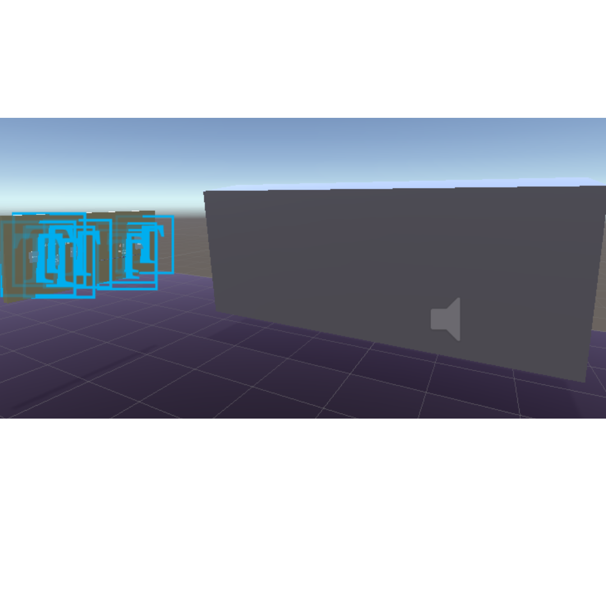

# VR Drum Sequencer

A virtual reality application that lets you create drum loops in an immersive 3D environment.

## Interface Overview

The application consists of two main racks, as shown in the image above:
- The control rack on the left contains the sound browser, BPM controls, and playback buttons
- The channel rack on the right is where your drum patterns appear

## How to Use

### Control Rack
Located on the left side of the environment, the control rack contains three main controls from left to right:

1. Sound Browser: Browse through available drum sounds using the Previous and Next buttons
2. BPM Slider: Adjust the tempo of your sequence
3. Play/Pause Button: Control playback of your drum pattern

### Creating Drum Patterns

To create a drum sequence:

1. Navigate through available sounds using the Previous and Next buttons in the sound browser
2. When you find a sound you like, press the Create button to generate a new 16-step channel
   - Note: Channel creation cannot be undone - you will need to restart the application to remove channels
3. The new channel will appear on the channel rack (right side)
4. Activate steps in your pattern by pressing them - active steps will turn green
5. Use the Play button to hear your sequence
6. Adjust the BPM slider to set your desired tempo

## Important Notes

- Channels cannot be removed once created without restarting the application
- Each channel consists of 16 steps
- Active steps are indicated by a green color
- The BPM can be adjusted at any time using the slider
